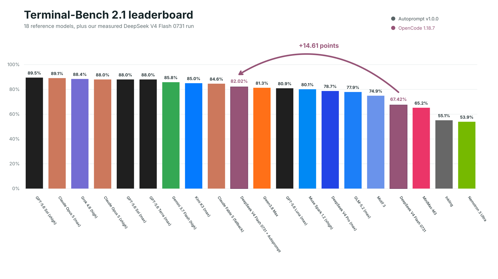
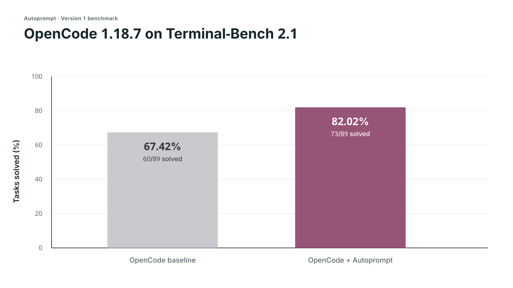
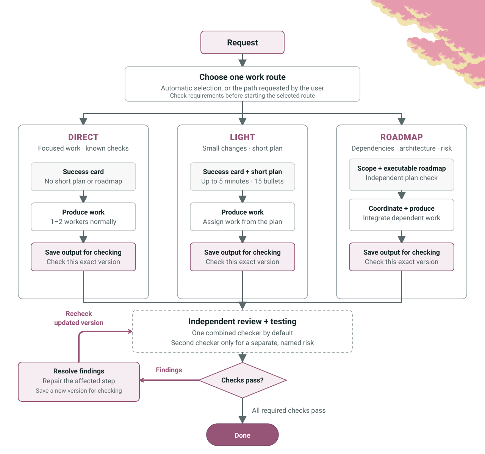
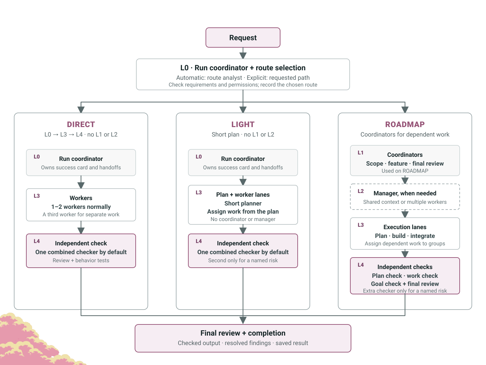

<p align="center">
  
</p>

<p align="center">Autoprompt is a coding-agent workflow that cuts failures by 45% by reviewing, fixing, and rechecking its work.</p>

<p align="center">
  <a href="#benchmarks"></a>
  <a href="https://github.com/Spielewoy/autoprompt-skill/releases/latest"></a>
  <a href="#install"></a>
  <a href="LICENSE"></a>
</p>

<p align="center">
  <a href="README.md"><b>English</b></a> |
  <a href="https://github.com/Spielewoy/autoprompt-skill/blob/main/docs/translations/zh.md">中文</a> |
  <a href="https://github.com/Spielewoy/autoprompt-skill/blob/main/docs/translations/ko.md">한국어</a> |
  <a href="https://github.com/Spielewoy/autoprompt-skill/blob/main/docs/translations/es.md">Español</a> |
  <a href="https://github.com/Spielewoy/autoprompt-skill/blob/main/docs/translations/ar.md">العربية</a>
</p>

## Contents

[Install](#install) · [Benchmarks](#benchmarks) · [Invocation](#anatomy-of-an-invocation) · [Run controls](#run-controls) · [Workflow](#how-it-works) · [Agents](#the-agents) · [Examples](#examples) · [FAQ](#faq) · [License](#license)

## Cross-harness v2 status

This is the Codex-v2 development branch. Native role projections and private installers now exist for all eleven provider keys, but **the new ports are not yet certified for production execution**. Installation checks and protocol fixtures do not prove a complete native task run. Read the [verification guide and remaining requirements](docs/guides/harness-v2-verification.md) before activating a port.

The support versions and benchmark results below originate from the previous release unless explicitly marked v2; they are not v2 conformance evidence. To test this checkout rather than the published npm release, use the local commands in the verification guide. No publication is needed.

## Install

Build this v2 checkout to test its exact CLI and installer. The public npm release and [GitHub Releases](https://github.com/Spielewoy/autoprompt-skill/releases/latest) remain separate publication channels.

### 1. Build and install this checkout

```bash
npm ci
npm pack
npm install -g ./autoprompt-skill-2.0.0-beta.1.tgz
```

`npm pack` runs the package checks and includes the current generated runtime. The installed CLI preserves a newer local build when the public registry contains an older version.

For the published release instead, use `npm install -g autoprompt-skill`.

### 2. Launch the installer

```bash
autoprompt
```

### 3. Install

Choose your coding agent, confirm its path, and install. `N` means enter another path.

For another CLI or IDE, choose `Custom coding agent` and use the [compatibility guide](docs/guides/custom-agent-compatibility.md).

<details>
<summary><strong>Install from source</strong></summary>

```bash
git clone https://github.com/Spielewoy/autoprompt-skill
cd autoprompt-skill
npm install -g .
autoprompt
```

</details>

### Requirements

- [Node.js 20+](https://nodejs.org/en/download)
- [Python 3.11+](https://www.python.org/downloads/) as `python3` or `python`, with [PyYAML](https://pypi.org/project/PyYAML/). POSIX installers also accept an explicit `AUTOPROMPT_PYTHON` executable.
- [Bash 4.3+](https://www.gnu.org/software/bash/) on macOS or Linux
- [Git](https://git-scm.com/downloads) only for the GitHub checkout method

### Historical support and current v2 status

| Status | Coding agent | Audited requirement | Key |
|---|---|---|---|
| V1 audit; v2 verification pending | [Claude Code](https://code.claude.com/docs/en/setup) | 2.1.219+; audited 2.1.233 | `claude` |
| Reviewed v2 base | [Codex](https://github.com/openai/codex) | Subagent-capable build; audited 0.148.0 | `codex` |
| V1 audit; v2 verification pending | [OpenCode](https://opencode.ai/docs/agents) | 1.18.7+; audited 1.18.18 | `opencode` |
| V1 audit; v2 verification pending | [Kilo Code](https://kilo.ai/docs/customize/custom-subagents) | 7.4.22+; audited 7.4.22 | `kilo` |
| V1 audit; v2 verification pending | [VS Code](https://code.visualstudio.com/docs/agents/subagents) | 1.133+; audited 1.133.0 with Copilot 0.61.0 | `vscode` |
| V1 audit; v2 verification pending | [Prime Agent](https://github.com/PrimeIntellect-ai/prime-agent) | 0.7.2; audited 0.7.2; native package adapter | `prime` |
| V1 audit; v2 verification pending | [Oh My Pi](https://omp.sh/) | 17.4.0+; adapter contract, install lifecycle, and native role payload verified for 17.4.0 | `omp` |
| V1 audit; v2 verification pending | [DeepSeek Harness](https://deepseek.com/harness/en/) | 0.1.0-rc.7+; adapter contract, install lifecycle, and native role payload verified for 0.1.0-rc.7 | `deepseek` |
| V2 integration; verification pending | [Hermes Agent](https://github.com/NousResearch/hermes-agent) | 0.21.1; owned plugin and native session adapter | `hermes` |
| V2 integration; verification pending | [Grok Build](https://docs.x.ai/build/overview) | 1.0.13; controller model proxy and isolated native process | `grok` |
| V2 port | [Reasonix](https://reasonix.io/docs/) | 1.30.0; private runtime and native wire tested; production conformance pending | `reasonix` |

See [support and audit notes](docs/faq/which-coding-agents-are-supported.md).

### Check, update, or remove an installation

- Check every detected installation: `autoprompt doctor --strict`
- Check one provider: `autoprompt doctor PROVIDER --strict`
- Update or repair: `autoprompt`, then choose an installed provider
- Uninstall interactively: `autoprompt uninstall`
- Uninstall one provider: `autoprompt uninstall PROVIDER`
- Show every command: `autoprompt help`

Replace `PROVIDER` with a key from the support table, such as `claude`, `codex`, or `prime`.

## Benchmarks

These are **version 1 benchmarks**. Version 2 benchmarks will follow.

<p align="center">
  
</p>

<details>
<summary><strong>Measured OpenCode comparison</strong></summary>

<p align="center">
  
</p>

| Track | Solved | Score | Failed |
|---|---:|---:|---:|
| OpenCode | 60/89 | 67.42% | 29 |
| **OpenCode + Autoprompt** | **73/89** | **82.02%** | **16** |
| **Change** | **+13 solves** | **+14.61 points** | **45% fewer** |

</details>

DeepSeek's 82.7% used its own test setup, so it is a reference point, not a comparable third run. Read the [setup and evidence boundaries](docs/benchmarks/terminal-bench-2.1.md), or [request another benchmark](https://github.com/Spielewoy/autoprompt-skill/issues/new).

<details>
<summary><strong>Expected trade-off:</strong> about 3x the time and 2x the tokens.</summary>

Timing and token logs were not retained, so these are planning estimates based on user experience reports, not measured benchmark results. The measured result was 29 to 16 failures (45% fewer) in this run, which translates to about 2x fewer mistakes. Note: for very small tasks, this may differ significantly.

</details>

## Anatomy of an invocation

The slash-command examples below describe v1 usage. On this branch, use `autoprompt activate PROVIDER --target /absolute/project -- "request"`; the public native entry only launches the explicit controller. Runtime admission remains required.

```text
/autoprompt mode=custom max_subs=4 agents=auto <goal>
```

| Part | What it does |
|---|---|
| `/autoprompt` | Starts the skill with your request. |
| `mode=custom` | Lets you set concurrency; `tokensaver` and `wide` are also available. |
| `max_subs=4` | Allows up to four subagents to run at once. |
| `agents=auto` | Selects models where supported. Use `off` to inherit the current model, or supply a model list. |
| `<goal>` | Describes the result you want, constraints, and how to check success. |
| `path=` | Chooses `auto`, `direct`, `light`, or `roadmap`. See [work paths](docs/faq/work-paths.md). |

In Codex, pass the optional path as a separate argument before the quoted request:

```bash
autoprompt activate codex -- path=light "add retries and test the edge cases"
```

To set Codex concurrency, use separate arguments and leave route selection automatic:

```bash
autoprompt activate codex -- --concurrency custom --max-subs 4 "add retries and test the edge cases"
```

## Reasonix v2

Reasonix uses the same v2 routes, 32 role profiles, state machine, checks, budgets, and recovery controller as Codex. Its adapter uses native streamed runs and session continuation. Installation places the runtime in a private bundle and leaves one manual launcher skill in the public skill directory.

```bash
autoprompt install reasonix
autoprompt configure reasonix --agents off
autoprompt activate reasonix --target /absolute/project -- "fix the bug and verify it"
```

Production activation currently returns `PROVIDER_UNSUPPORTED` because an independent signed Reasonix conformance record has not been supplied. Native transport tests cover actual tool output, token accounting, checker write denial, and session continuation; they do not establish complete provider conformance. See the [Reasonix v2 package](agents/reasonix/README.md).

## Run controls

Configure model selection with `autoprompt configure PROVIDER --agents MODEL --root /absolute/provider-config`. Use `--agents off` to inherit a configured provider model. A measured model registry is required for automatic or multiple-model selection. The controller owns route selection, concurrency, budgets, and child assignments; loading a native role cannot grant dispatch rights.

Native effort values differ between providers. Unsupported values are rejected. See the [v2 verification guide](docs/guides/harness-v2-verification.md) for exact mappings, configuration, and current admission requirements.

## How it works

<p align="center">
  <a href="assets/how-it-works-loop.svg"></a>
</p>

## The agents

<p align="center">
  <a href="assets/how-it-works-hierarchy.svg"></a>
</p>

## Examples

| Goal | Prompt |
|---|---|
| Fix | `/autoprompt fix the registration race and add a regression test` |
| Build | `/autoprompt mode=wide build the booking flow from API to checkout` |
| Research | `/autoprompt compare job queues against this codebase and recommend one` |
| Limit parallel work | `/autoprompt mode=custom max_subs=4 migrate every model` |

In Codex, use `autoprompt activate codex -- "<goal>"`. In Oh My Pi, use `/skill:autoprompt`.

## FAQ

<details>
<summary><strong>Does Autoprompt mean I literally do not have to prompt?</strong></summary>

No. Give it a clear goal, constraints, and success criteria. Autoprompt handles the execution loop, so you do not have to prompt every step. [Details](docs/faq/does-autoprompt-mean-i-do-not-have-to-prompt.md)

</details>

<details>
<summary><strong>How autonomous is Autoprompt?</strong></summary>

It can scope, implement, test, review, repair, and verify a goal. It stops for choices that change the result, actions that need your authority, or blockers it cannot safely resolve. [Details](docs/faq/how-autonomous-is-autoprompt.md)

</details>

<details>
<summary><strong>What are the layers for?</strong></summary>

The layers separate coordination, management, execution, and independent judgment. That separation keeps one agent from planning, approving, and verifying its own work. [Details](docs/faq/what-are-the-layers-for.md)

</details>

<details>
<summary><strong>What are the paths?</strong></summary>

`path=auto` selects a route for the task. `direct` starts focused work, `light` adds a short plan, and `roadmap` organizes dependent work before execution. Every path includes independent verification. [Details](docs/faq/work-paths.md)

</details>

<details>
<summary><strong>What do `mode`, `max_subs`, `agents`, and `path` do?</strong></summary>

`mode=tokensaver` caps active subagents at six. `mode=wide` opens every ready lane. `mode=custom max_subs=N` sets your own ceiling. `agents` controls model routing where the host supports it, and `path` controls how the work is planned and coordinated. [Details](docs/faq/tokensaver-vs-wide-vs-custom.md)

</details>

<details>
<summary><strong>Why does Autoprompt not start in the background?</strong></summary>

Because it changes cost, time, and workflow. Start it explicitly with `/autoprompt <goal>`, or `autoprompt activate codex -- "<goal>"` in Codex.

</details>

## License

[MIT](LICENSE). Copyright 2026 [Spielewoy](https://github.com/Spielewoy).

Community: [Contributors](docs/CONTRIBUTORS.md), [Contributing](docs/CONTRIBUTING.md), [Code of Conduct](docs/CODE_OF_CONDUCT.md), [Security](docs/SECURITY.md), and [Support](docs/SUPPORT.md).
