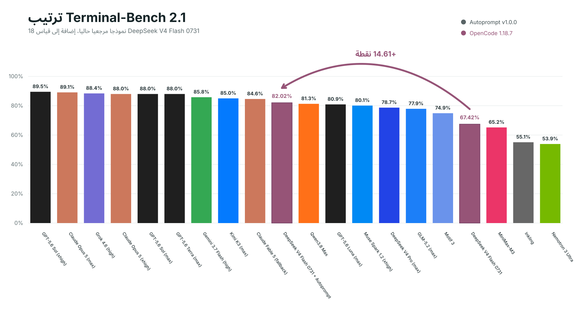
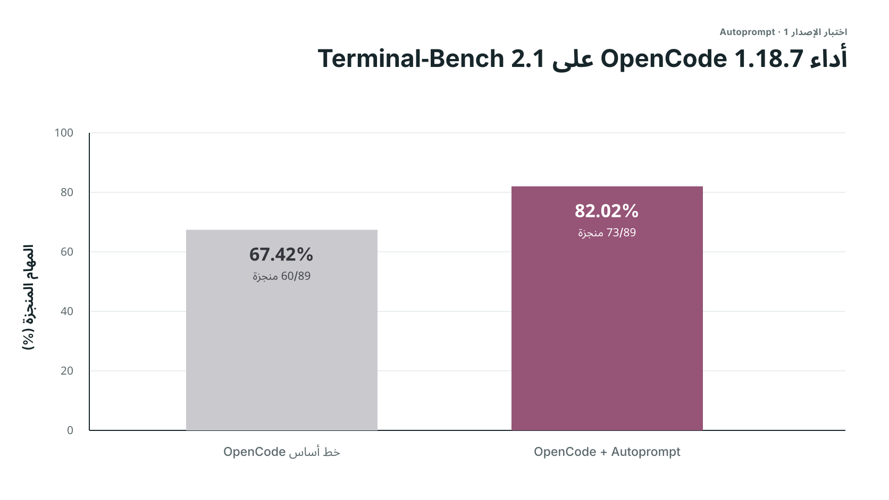
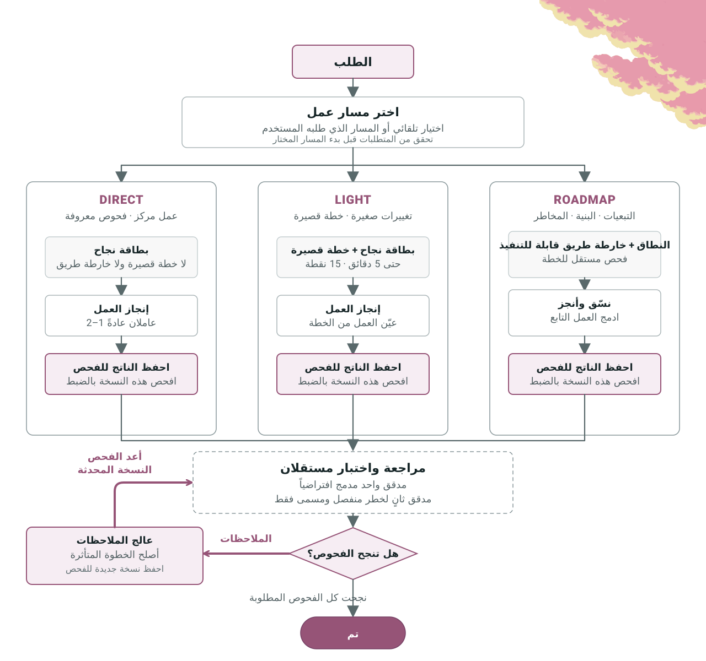
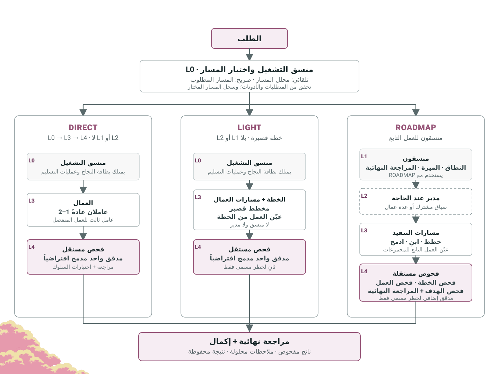

> تحتفظ هذه الصفحة بوثائق الإصدار v1. لتثبيت فرع v2 ومعرفة إعدادات اختيار النماذج ومتطلبات التحقق من التشغيل، راجع [الوثائق الإنجليزية الحالية](../../README.md) و[دليل التحقق من v2](../guides/harness-v2-verification.md). نتائج تدقيق v1 أدناه لا تثبت جاهزية v2.

<div dir="rtl" align="right">

<p align="center">
  
</p>

<p align="center">Autoprompt سير عمل لوكلاء البرمجة يقلل الإخفاقات بنسبة 45% عبر مراجعة العمل وإصلاحه وإعادة التحقق منه.</p>

<p align="center">
  <a href="#نتائج-الاختبار-المعياري"></a>
  <a href="https://github.com/Spielewoy/autoprompt-skill/releases/latest"></a>
  <a href="#التثبيت"></a>
  <a href="../../LICENSE"></a>
</p>

<p align="center">
  <a href="../../README.md">English</a> |
  <a href="zh.md">中文</a> |
  <a href="ko.md">한국어</a> |
  <a href="es.md">Español</a> |
  <a href="ar.md"><b>العربية</b></a>
</p>

## المحتويات

[التثبيت](#التثبيت) · [النتائج](#نتائج-الاختبار-المعياري) · [الاستدعاء](#بنية-الاستدعاء) · [التحكم](#عناصر-التحكم-في-التشغيل) · [آلية العمل](#كيف-يعمل) · [الوكلاء](#الوكلاء) · [الأمثلة](#أمثلة) · [الأسئلة](#الأسئلة-الشائعة) · [الترخيص](#الترخيص)

## التثبيت

استخدم CLI أدناه أو نزل أحد المثبتات من [GitHub Releases](https://github.com/Spielewoy/autoprompt-skill/releases/tag/v1.0.4).

### 1. تثبيت CLI

```bash
npm install -g autoprompt-skill
```

### 2. تشغيل المثبت

```bash
autoprompt
```

### 3. التثبيت

اختر وكيل البرمجة، وأكد المسار، ثم ثبت. يعني `N` إدخال مسار آخر.

لاستخدام CLI أو IDE آخر، اختر `Custom coding agent` واتبع [دليل التوافق](../guides/custom-agent-compatibility.md).

<details>
<summary><strong>التثبيت من المصدر</strong></summary>

```bash
git clone https://github.com/Spielewoy/autoprompt-skill
cd autoprompt-skill
npm install -g .
autoprompt
```

</details>

### المتطلبات

- [Node.js 20+](https://nodejs.org/en/download)
- [Python 3.11+](https://www.python.org/downloads/) متاح باسم `python`، مع [PyYAML](https://pypi.org/project/PyYAML/)
- [Bash 4.3+](https://www.gnu.org/software/bash/) على macOS أو Linux
- [Git](https://git-scm.com/downloads) لطريقة نسخة GitHub فقط

### الدعم

| الحالة | وكيل البرمجة | المتطلب المدقق | المفتاح |
|---|---|---|---|
| يعمل | [Claude Code](https://code.claude.com/docs/en/setup) | 2.1.219+؛ تم تدقيق 2.1.233 | `claude` |
| يعمل | [Codex](https://github.com/openai/codex) | إصدار يدعم الوكلاء الفرعيين؛ تم تدقيق 0.148.0 | `codex` |
| يعمل | [OpenCode](https://opencode.ai/docs/agents) | 1.18.7+؛ تم تدقيق 1.18.18 | `opencode` |
| يعمل | [Kilo Code](https://kilo.ai/docs/customize/custom-subagents) | 7.4.22+؛ تم تدقيق 7.4.22 | `kilo` |
| يعمل | [VS Code](https://code.visualstudio.com/docs/agents/subagents) | 1.133+؛ تم تدقيق 1.133.0 مع Copilot 0.61.0 | `vscode` |
| يعمل | [Prime Agent](https://github.com/PrimeIntellect-ai/prime-agent) | 0.7.2؛ تم تدقيق 0.7.2؛ محول حزمة أصلي | `prime` |
| يعمل | [Oh My Pi](https://omp.sh/) | 17.4.0+؛ تم التحقق من عقد الموائم ودورة التثبيت وحمولة الدور الأصلية على 17.4.0 | `omp` |
| يعمل | [DeepSeek Harness](https://deepseek.com/harness/en/) | 0.1.0-rc.7+؛ تم التحقق من عقد الموائم ودورة التثبيت وحمولة الدور الأصلية على 0.1.0-rc.7 | `deepseek` |
| نقل V2 | [Reasonix](https://reasonix.io/docs/) | 1.30.0؛ تم اختبار النقل الأصلي؛ التحقق المستقل للإنتاج ما زال معلقًا | `reasonix` |

راجع [ملاحظات الدعم والتدقيق](../faq/which-coding-agents-are-supported.md).

### الفحص أو التحديث أو الإزالة

- فحص كل التثبيتات المكتشفة: `autoprompt doctor --strict`
- فحص مضيف واحد: `autoprompt doctor PROVIDER --strict`
- التحديث أو الإصلاح: شغل `autoprompt` ثم اختر مضيفا مثبتا
- الإزالة التفاعلية: `autoprompt uninstall`
- إزالة مضيف واحد: `autoprompt uninstall PROVIDER`
- عرض جميع الأوامر: `autoprompt help`

استبدل `PROVIDER` بمفتاح من جدول الدعم، مثل `claude` أو `codex` أو `prime`.

## نتائج الاختبار المعياري

هذه **نتائج اختبارات الإصدار 1**. ستُنشر نتائج الإصدار 2 لاحقًا.

<p align="center">
  
</p>

<details>
<summary><strong>مقارنة OpenCode المقاسة</strong></summary>

<p align="center">
  
</p>

| التشغيل | المهام المنجزة | النتيجة | الإخفاقات |
|---|---:|---:|---:|
| OpenCode | 60/89 | 67.42% | 29 |
| **OpenCode + Autoprompt** | **73/89** | **82.02%** | **16** |
| **الفارق** | **+13 مهمة** | **+14.61 نقطة** | **أقل بنسبة 45%** |

</details>

جاءت نتيجة DeepSeek البالغة 82.7% من إعداد اختبار مختلف، لذا فهي نقطة مرجعية وليست تشغيلا ثالثا قابلا للمقارنة. راجع [إعداد الاختبار وحدود الأدلة](../benchmarks/terminal-bench-2.1.md)، أو [اطلب اختبارا معياريا آخر](https://github.com/Spielewoy/autoprompt-skill/issues/new).

<details>
<summary><strong>التكلفة المتوقعة:</strong> نحو 3x من الوقت و2x من الرموز.</summary>

لم تحفظ سجلات الوقت والرموز، لذا فهذه تقديرات تخطيط مبنية على تجارب المستخدمين وليست نتائج معيارية مقاسة. في هذا التشغيل، انخفضت حالات الفشل من 29 إلى 16 (أقل بنسبة 45%)، أي نحو نصف عدد الأخطاء (تحسن يقارب 2x). قد تختلف النتيجة كثيرا في المهام الصغيرة جدا.

</details>

## بنية الاستدعاء

```text
/autoprompt mode=custom max_subs=4 agents=auto <goal>
```

| الجزء | الوظيفة |
|---|---|
| `/autoprompt` | بدء المهارة. |
| `mode=custom` | التزامن: tokensaver أو wide أو custom. |
| `max_subs=4` | أربعة وكلاء فرعيين متزامنين كحد أقصى. |
| `agents=auto` | اختيار تلقائي أو النموذج الحالي (off) أو قائمة. |
| `<goal>` | النتيجة المطلوبة والقيود وطريقة التحقق. |
| `path=` | المسار: auto أو direct أو light أو roadmap. |

مثال في Codex:

```bash
autoprompt activate codex -- path=light "<goal>"
```


## عناصر التحكم في التشغيل

استخدم `mode=` لتحديد التوازي. واستخدم `agents=` لتوجيه النماذج عندما يدعم المضيف ذلك.

| التحكم | Claude Code | Codex | OpenCode | Kilo | VS Code | Prime Agent | Oh My Pi | DeepSeek Harness | Reasonix |
|---|:---:|:---:|:---:|:---:|:---:|:---:|:---:|:---:|:---:|
| `mode=` | ✓ | ✓ | ✓ | ✓ | ✓ | ✓ | ✓ | ✓ | ✓ |
| التوجيه المخصص عبر `agents=` | ✓ | ✓ | ✕ غير متاح - يرث النموذج النشط | ✕ غير متاح - يرث النموذج النشط | ✕ غير متاح - يرث النموذج النشط | ✕ غير متاح - يرث النموذج الأب المحدد | ✕ غير متاح - يرث النموذج الأب المحدد | ✕ غير متاح - يرث النموذج الأب المحدد | ✓ إعداد V2؛ التفعيل يتطلب التحقق |

## كيف يعمل

<p align="center">
  <a href="../../assets/i18n/ar/how-it-works-loop.svg"></a>
</p>

## الوكلاء

<p align="center">
  <a href="../../assets/i18n/ar/how-it-works-hierarchy.svg"></a>
</p>

## أمثلة

| الهدف | الأمر |
|---|---|
| إصلاح | `/autoprompt أصلح حالة التسابق في التسجيل وأضف اختبار منع تراجع` |
| بناء | `/autoprompt mode=wide أنشئ مسار الحجز من API إلى الدفع` |
| بحث | `/autoprompt قارن قوائم انتظار المهام لهذا المستودع وأوص بواحدة` |
| تقييد العمل المتوازي | `/autoprompt mode=custom max_subs=4 انقل جميع النماذج` |

استخدم `autoprompt activate codex -- "<goal>"` بدلا من `/autoprompt` في Codex. في Oh My Pi، استخدم `/skill:autoprompt`.

## الأسئلة الشائعة

<details>
<summary><strong>هل يعني Autoprompt أنني لن أحتاج إلى كتابة تعليمات؟</strong></summary>

لا. قدم له هدفا واضحا وقيودا ومعايير نجاح. يتولى Autoprompt دورة التنفيذ، فلا تحتاج إلى كتابة تعليمات لكل خطوة. [التفاصيل](../faq/does-autoprompt-mean-i-do-not-have-to-prompt.md)

</details>

<details>
<summary><strong>ما مدى استقلالية Autoprompt؟</strong></summary>

يمكنه تحديد النطاق والتنفيذ والاختبار والمراجعة والإصلاح والتحقق من الهدف. يتوقف عند الخيارات التي تغير النتيجة، أو الإجراءات التي تحتاج إلى تفويضك، أو العوائق التي لا يستطيع حلها بأمان. [التفاصيل](../faq/how-autonomous-is-autoprompt.md)

</details>

<details>
<summary><strong>ما فائدة الطبقات؟</strong></summary>

تفصل الطبقات بين التنسيق والإدارة والتنفيذ والتقييم المستقل. وبذلك لا يخطط الوكيل نفسه لعمله ثم يوافق عليه ويتحقق منه. [التفاصيل](../faq/what-are-the-layers-for.md)

</details>

<details>
<summary><strong>ما هي مسارات العمل؟</strong></summary>

يختار `path=auto` المسار المناسب. يبدأ `direct` العمل المحدد، ويضيف `light` خطة قصيرة، وينظم `roadmap` الأعمال المترابطة. تتضمن جميع المسارات تحققًا مستقلًا. [التفاصيل](../faq/work-paths.md)

</details>

<details>
<summary><strong>ما الذي تتحكم فيه `mode` و`max_subs` و`agents`؟</strong></summary>

تحد `mode=tokensaver` الوكلاء الفرعيين النشطين بستة، وتفتح `mode=wide` كل المسارات الجاهزة، وتحدد `mode=custom max_subs=N` سقفا مخصصا، وتتحكم `agents` في توجيه النماذج عندما يدعمه المضيف. [التفاصيل](../faq/tokensaver-vs-wide-vs-custom.md)

</details>

<details>
<summary><strong>لماذا لا يبدأ Autoprompt في الخلفية؟</strong></summary>

لأنه يغير التكلفة والوقت وسير العمل. شغله صراحة باستخدام `/autoprompt <الهدف>`، أو `autoprompt activate codex -- "<goal>"` في Codex.

</details>

## الترخيص

[MIT](../../LICENSE). حقوق النشر 2026 [Spielewoy](https://github.com/Spielewoy).

المجتمع: [المساهمة](../CONTRIBUTING.md)، [قواعد السلوك](../CODE_OF_CONDUCT.md)، [الأمان](../SECURITY.md)، و[الدعم](../SUPPORT.md).

</div>
