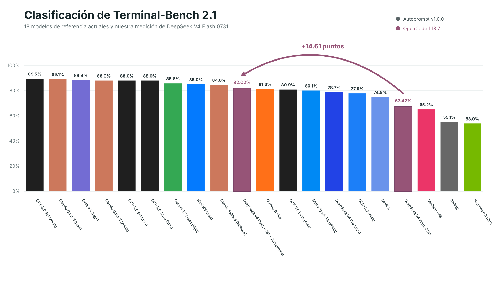
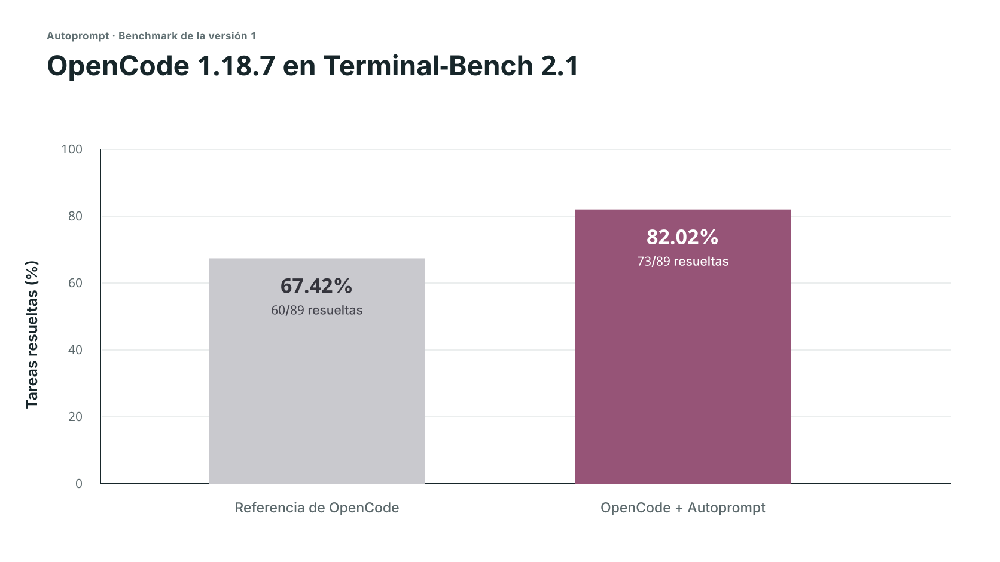
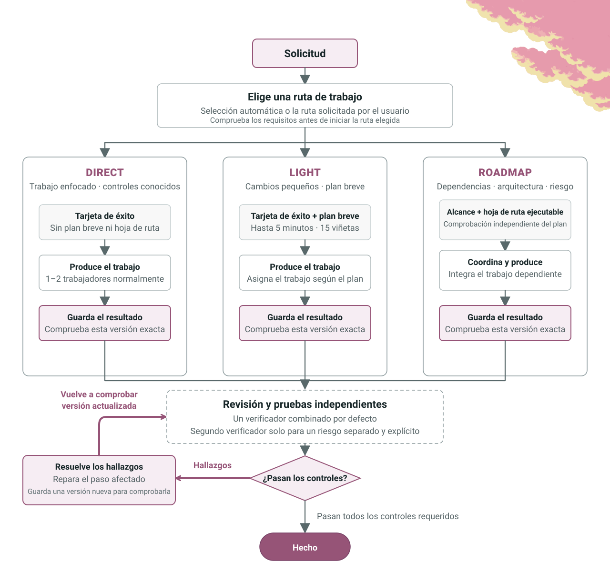
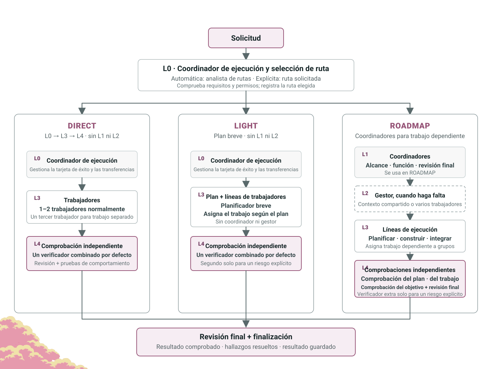

<p align="center">
  
</p>

<p align="center">Autoprompt es un flujo de trabajo para agentes de código que reduce los fallos un 45% al revisar, corregir y volver a comprobar su trabajo.</p>

<p align="center">
  <a href="#benchmarks"></a>
  <a href="https://github.com/Spielewoy/autoprompt-skill/releases/latest"></a>
  <a href="#instalar"></a>
  <a href="../../LICENSE"></a>
</p>

<p align="center">
  <a href="../../README.md">English</a> |
  <a href="zh.md">中文</a> |
  <a href="ko.md">한국어</a> |
  <a href="es.md"><b>Español</b></a> |
  <a href="ar.md">العربية</a>
</p>

## Contenido

[Instalar](#instalar) · [Benchmarks](#benchmarks) · [Invocación](#anatomía-de-una-invocación) · [Controles de ejecución](#controles-de-ejecución) · [Flujo de trabajo](#cómo-funciona) · [Agentes](#los-agentes) · [Ejemplos](#ejemplos) · [Preguntas frecuentes](#preguntas-frecuentes) · [Licencia](#licencia)

## Instalar

Usa la CLI siguiente o descarga un instalador desde [GitHub Releases](https://github.com/Spielewoy/autoprompt-skill/releases/latest).

Para esta beta de v2, usa **Instalar desde el código fuente** más abajo.

### 1. Instala la CLI

```bash
npm install -g autoprompt-skill
```

### 2. Inicia el instalador

```bash
autoprompt
```

### 3. Instala

Elige tu agente de código, confirma su ruta e instala. `N` significa introducir otra ruta.

Para otra CLI o IDE, elige `Custom coding agent` y usa la [guía de compatibilidad](../guides/custom-agent-compatibility.md).

<details>
<summary><strong>Instalar desde el código fuente</strong></summary>

```bash
git clone --branch codex/v2-final-merge https://github.com/Spielewoy/autoprompt-skill
cd autoprompt-skill
npm install -g .
autoprompt
```

</details>

### Requisitos

- [Node.js 20+](https://nodejs.org/en/download)
- [Python 3.11+](https://www.python.org/downloads/) disponible como `python3` o `python`, con [PyYAML](https://pypi.org/project/PyYAML/)
- [Bash 4.3+](https://www.gnu.org/software/bash/) en macOS o Linux
- [Git](https://git-scm.com/downloads) solo para el método de copia desde GitHub

### Compatibilidad

| Estado | Agente de código | Versión probada | Clave |
|---|---|---|---|
| Operativo | [Claude Code](https://code.claude.com/docs/en/setup) | 2.1.263 | `claude` |
| Operativo | [Codex](https://github.com/openai/codex) | 0.148.0 | `codex` |
| Operativo | [OpenCode](https://opencode.ai/docs/agents) | 1.18.29 | `opencode` |
| Operativo | [Kilo Code](https://kilo.ai/docs/customize/custom-subagents) | 7.5.15 | `kilo` |
| Operativo | [VS Code](https://code.visualstudio.com/docs/agents/subagents) | 1.136.1 | `vscode` |
| Operativo | [Prime Agent](https://github.com/PrimeIntellect-ai/prime-agent) | 0.7.2 | `prime` |
| Operativo | [Oh My Pi](https://omp.sh/) | 18.1.14 | `omp` |
| Operativo | [DeepSeek Harness](https://deepseek.com/harness/en/) | 0.1.2-rc.1 | `deepseek` |
| Operativo | [Reasonix](https://reasonix.io/docs/) | 1.30.0 | `reasonix` |
| Operativo | [Hermes Agent](https://github.com/NousResearch/hermes-agent) | 0.21.1 | `hermes` |
| Operativo | [Grok Build](https://docs.x.ai/build/overview) | 1.0.13 | `grok` |

Estas versiones superaron ejecuciones en Linux. La disponibilidad de modelos y plataformas varía según el proveedor.

Consulta las [notas de soporte y auditoría](../faq/which-coding-agents-are-supported.md).

### Comprobar, actualizar o eliminar una instalación

- Comprobar todas las instalaciones detectadas: `autoprompt doctor --strict`
- Comprobar un proveedor: `autoprompt doctor PROVIDER --strict`
- Actualizar o reparar: `autoprompt` y después elegir un proveedor instalado
- Desinstalar de forma interactiva: `autoprompt uninstall`
- Desinstalar un proveedor: `autoprompt uninstall PROVIDER`
- Mostrar todos los comandos: `autoprompt help`

Sustituye `PROVIDER` por una clave de la tabla de compatibilidad, como `claude`, `codex` o `prime`.

## Benchmarks

Estos son **benchmarks de la versión 1**. Los benchmarks de la versión 2 vendrán después.

<p align="center">
  
</p>

<details>
<summary><strong>Comparación medida con OpenCode</strong></summary>

<p align="center">
  
</p>

| Ejecución | Resueltas | Puntuación | Fallos |
|---|---:|---:|---:|
| OpenCode | 60/89 | 67.42% | 29 |
| **OpenCode + Autoprompt** | **73/89** | **82.02%** | **16** |
| **Cambio** | **+13 resueltas** | **+14.61 puntos** | **45% menos** |

</details>

El 82.7% de DeepSeek usó su propia configuración de prueba, así que es un punto de referencia, no una tercera ejecución comparable. Lee la [configuración y los límites de la evidencia](../benchmarks/terminal-bench-2.1.md) o [solicita otro benchmark](https://github.com/Spielewoy/autoprompt-skill/issues/new).

<details>
<summary><strong>Coste previsto:</strong> aproximadamente 3 veces el tiempo y 2 veces los tokens.</summary>

No se conservaron registros de tiempo ni de tokens, así que son estimaciones de planificación basadas en informes de usuarios, no resultados medidos del benchmark. El resultado medido fue pasar de 29 a 16 fallos (45% menos) en esta ejecución, lo que equivale a aproximadamente 2 veces menos errores. En tareas muy pequeñas, esto puede variar mucho.

</details>

## Anatomía de una invocación

```bash
autoprompt activate PROVIDER --target /absolute/project -- "<goal>"
```

| Parte | Función |
|---|---|
| `PROVIDER` | Una clave de la tabla de compatibilidad, como `claude`, `codex` o `grok`. |
| `--target` | El proyecto en el que se trabajará. Omítelo para usar el directorio actual. |
| `--` | Separa las opciones del lanzador de la solicitud. |
| `<goal>` | El resultado que quieres, las restricciones y cómo comprobar el éxito. |
| `path=` | `auto`, `direct`, `light` o `roadmap`, antes del objetivo entre comillas. Consulta las [rutas de trabajo](../faq/work-paths.md). |

```bash
autoprompt activate codex -- path=light "add retries and test the edge cases"
```

## Controles de ejecución

Los mismos controles se aplican a los once proveedores. [Configuración de modelos personalizados](../faq/how-to-add-custom-models.md)

| Control | Función |
|---|---|
| `--concurrency tokensaver` | Ejecuta como máximo seis subagentes a la vez. |
| `--concurrency wide` | Inicia trabajo independiente listo hasta el límite del host. |
| `--concurrency custom --max-subs N` | Establece tu propio límite de concurrencia. |
| `configure PROVIDER --agents off` | Usa el modelo configurado del proveedor. |
| `configure PROVIDER --agents MODEL` | Selecciona un modelo. Añade `--effort LEVEL` cuando sea compatible. |
| `configure PROVIDER --agents auto --model-map FILE` | Elige de un registro de modelos medido. Una lista de modelos separada por comas también requiere `--model-map`. |

Pasa los controles de concurrencia después de `--`, antes del objetivo entre comillas:

```bash
autoprompt activate codex -- --concurrency custom --max-subs 4 "add retries and tests"
autoprompt configure claude --agents provider/model --effort low
```

## Cómo funciona

<p align="center">
  <a href="../../assets/i18n/es/how-it-works-loop.svg"></a>
</p>

## Los agentes

<p align="center">
  <a href="../../assets/i18n/es/how-it-works-hierarchy.svg"></a>
</p>

## Ejemplos

| Objetivo | Prompt |
|---|---|
| Corregir | `autoprompt activate claude -- "fix the registration race and add a regression test"` |
| Construir | `autoprompt activate codex -- --concurrency wide "build the booking flow from API to checkout"` |
| Investigar | `autoprompt activate hermes -- "compare job queues against this codebase and recommend one"` |
| Limitar trabajo paralelo | `autoprompt activate grok -- --concurrency custom --max-subs 4 "migrate every model"` |

Ejecuta estos comandos desde tu proyecto o proporciona `--target /absolute/project` antes de `--`.

## Preguntas frecuentes

<details>
<summary><strong>¿Autoprompt significa que literalmente no tengo que escribir prompts?</strong></summary>

No. Dale un objetivo claro, restricciones y criterios de éxito. Autoprompt gestiona el ciclo de ejecución, así que no tienes que escribir un prompt para cada paso. [Detalles](../faq/does-autoprompt-mean-i-do-not-have-to-prompt.md)

</details>

<details>
<summary><strong>¿Hasta qué punto es autónomo Autoprompt?</strong></summary>

Puede delimitar, implementar, probar, revisar, reparar y verificar un objetivo. Se detiene ante decisiones que cambian el resultado, acciones que necesitan tu autorización o bloqueos que no puede resolver de forma segura. [Detalles](../faq/how-autonomous-is-autoprompt.md)

</details>

<details>
<summary><strong>¿Para qué sirven las capas?</strong></summary>

Las capas separan la coordinación, la gestión, la ejecución y el juicio independiente. Así, un agente no planifica, aprueba y verifica su propio trabajo. [Detalles](../faq/what-are-the-layers-for.md)

</details>

<details>
<summary><strong>¿Qué son las rutas?</strong></summary>

`path=auto` selecciona una ruta para la tarea. `direct` inicia un trabajo enfocado, `light` añade un plan breve y `roadmap` organiza el trabajo dependiente antes de ejecutarlo. Todas las rutas incluyen verificación independiente. [Detalles](../faq/work-paths.md)

</details>

<details>
<summary><strong>¿Qué controlan la concurrencia, los modelos y las rutas?</strong></summary>

`--concurrency` y `--max-subs` establecen los límites del trabajo paralelo. `configure --agents` selecciona modelos y `path=` determina cómo se planifica y coordina el trabajo. [Detalles](../faq/tokensaver-vs-wide-vs-custom.md)

</details>

<details>
<summary><strong>¿Por qué Autoprompt no se inicia en segundo plano?</strong></summary>

Porque cambia el coste, el tiempo y el flujo de trabajo. Inícialo explícitamente con `autoprompt activate PROVIDER -- "<goal>"`.

</details>

## Licencia

[MIT](../../LICENSE). Copyright 2026 [Spielewoy](https://github.com/Spielewoy).

Comunidad: [Colaboradores](../CONTRIBUTORS.md), [Contribuir](../CONTRIBUTING.md), [Código de conducta](../CODE_OF_CONDUCT.md), [Seguridad](../SECURITY.md) y [Soporte](../SUPPORT.md).
