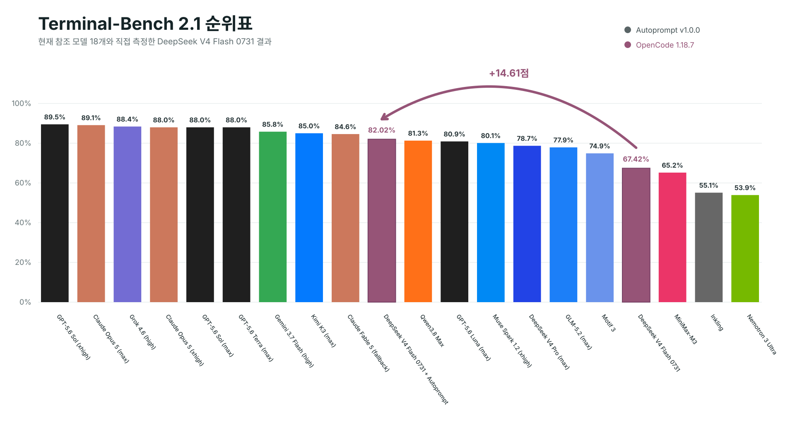
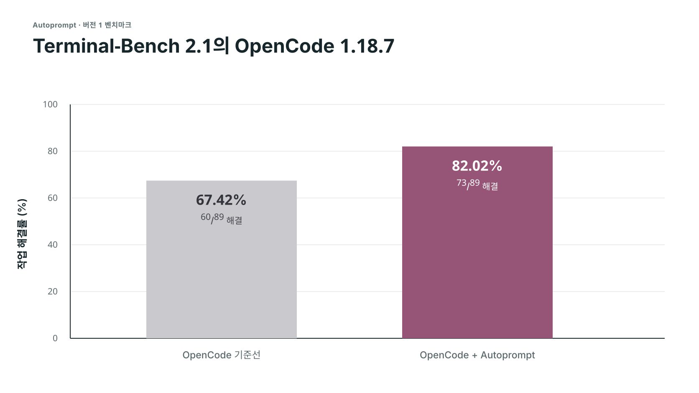
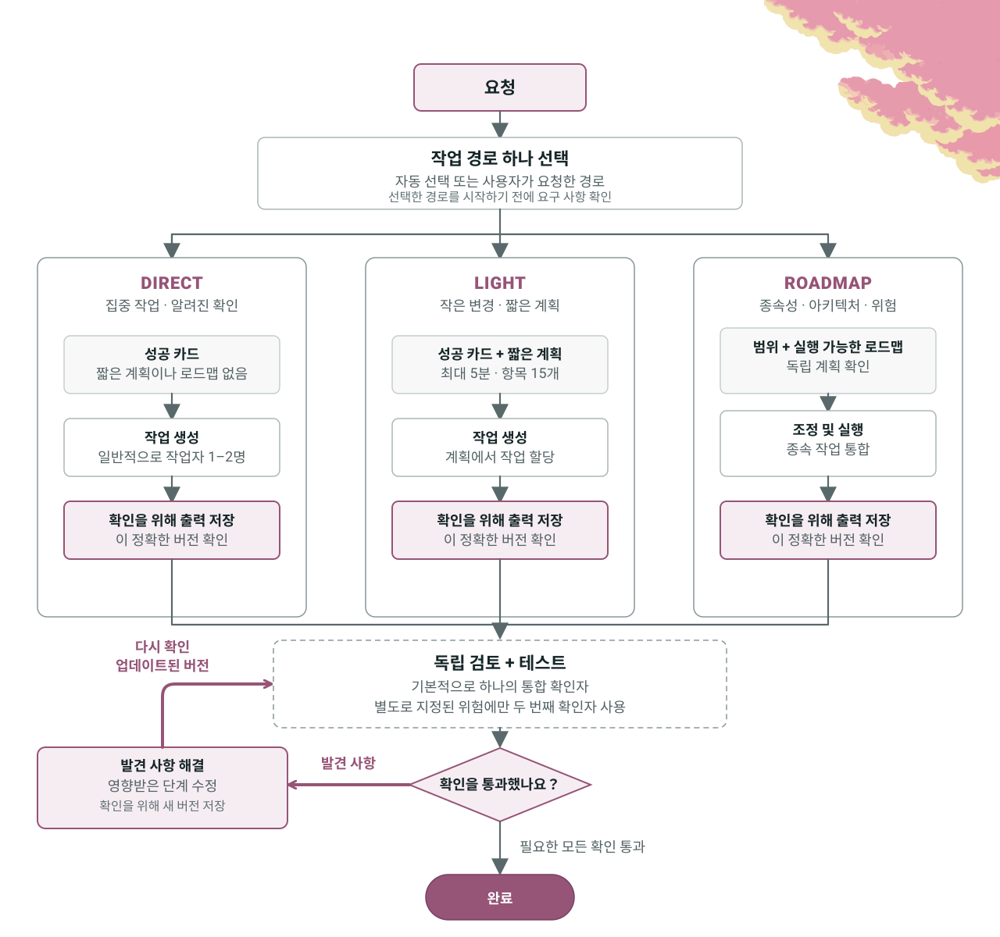
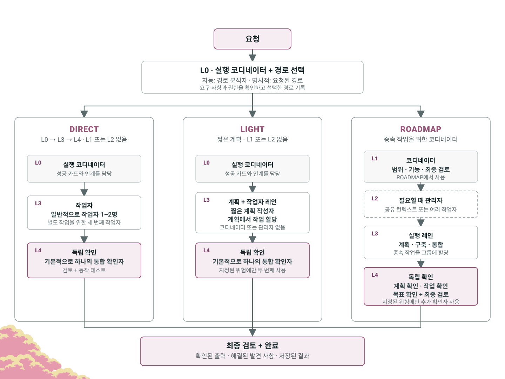

<p align="center">
  
</p>

<p align="center">Autoprompt는 작업을 검토하고, 수정하고, 다시 확인하여 실패를 45% 줄이는 코딩 에이전트 워크플로입니다.</p>

<p align="center">
  <a href="#벤치마크"></a>
  <a href="https://github.com/Spielewoy/autoprompt-skill/releases/latest"></a>
  <a href="#설치"></a>
  <a href="../../LICENSE"></a>
</p>

<p align="center">
  <a href="../../README.md">English</a> |
  <a href="zh.md">中文</a> |
  <a href="ko.md"><b>한국어</b></a> |
  <a href="es.md">Español</a> |
  <a href="ar.md">العربية</a>
</p>

## 목차

[설치](#설치) · [벤치마크](#벤치마크) · [호출 구조](#호출-구조) · [실행 제어](#실행-제어) · [작동 방식](#작동-방식) · [에이전트](#에이전트) · [예시](#예시) · [FAQ](#자주-묻는-질문) · [라이선스](#라이선스)

## 설치

아래 CLI를 사용하거나 [GitHub Releases](https://github.com/Spielewoy/autoprompt-skill/releases/latest)에서 설치 프로그램을 받으세요.

### 1. CLI 설치

```bash
npm install -g https://github.com/Spielewoy/autoprompt-skill/releases/download/v2.0.0/autoprompt-skill-2.0.0.tgz
```

### 2. 설치 프로그램 실행

```bash
autoprompt
```

### 3. 설치

코딩 에이전트를 선택하고 경로를 확인한 다음 설치하세요. `N`은 다른 경로를 입력한다는 뜻입니다.

다른 CLI나 IDE를 사용하려면 `Custom coding agent`를 선택하고 [호환성 가이드](../guides/custom-agent-compatibility.md)를 따르세요.

<details>
<summary><strong>소스에서 설치</strong></summary>

```bash
git clone https://github.com/Spielewoy/autoprompt-skill
cd autoprompt-skill
npm install -g .
autoprompt
```

</details>

### 요구 사항

- [Node.js 20+](https://nodejs.org/en/download)
- [Python 3.11+](https://www.python.org/downloads/)을 `python3` 또는 `python`으로 사용할 수 있어야 하며 [PyYAML](https://pypi.org/project/PyYAML/)이 필요합니다.
- macOS 또는 Linux의 [Bash 4.3+](https://www.gnu.org/software/bash/)
- GitHub 체크아웃 방식에서만 필요한 [Git](https://git-scm.com/downloads)

### 지원

| 상태 | 코딩 에이전트 | 테스트한 버전 | 키 |
|---|---|---|---|
| 작동 | [Claude Code](https://code.claude.com/docs/en/setup) | 2.1.263 | `claude` |
| 작동 | [Codex](https://github.com/openai/codex) | 0.148.0 | `codex` |
| 작동 | [OpenCode](https://opencode.ai/docs/agents) | 1.18.29 | `opencode` |
| 작동 | [Kilo Code](https://kilo.ai/docs/customize/custom-subagents) | 7.5.15 | `kilo` |
| 작동 | [VS Code](https://code.visualstudio.com/docs/agents/subagents) | 1.136.1 | `vscode` |
| 작동 | [Prime Agent](https://github.com/PrimeIntellect-ai/prime-agent) | 0.7.2 | `prime` |
| 작동 | [Oh My Pi](https://omp.sh/) | 18.1.14 | `omp` |
| 작동 | [DeepSeek Harness](https://deepseek.com/harness/en/) | 0.1.2-rc.1 | `deepseek` |
| 작동 | [Reasonix](https://reasonix.io/docs/) | 1.30.0 | `reasonix` |
| 작동 | [Hermes Agent](https://github.com/NousResearch/hermes-agent) | 0.21.1 | `hermes` |
| 작동 | [Grok Build](https://docs.x.ai/build/overview) | 1.0.13 | `grok` |

이 버전들은 Linux 실행을 통과했습니다. 모델과 플랫폼의 사용 가능 여부는 제공자마다 다릅니다.

[지원 및 감사 참고 사항](../faq/which-coding-agents-are-supported.md)을 확인하세요.

### 설치 확인, 업데이트 또는 제거

- 감지된 모든 설치 확인: `autoprompt doctor --strict`
- 한 제공자 확인: `autoprompt doctor PROVIDER --strict`
- 업데이트 또는 복구: `autoprompt`를 실행한 뒤 설치된 제공자를 선택
- 대화형 제거: `autoprompt uninstall`
- 한 제공자 제거: `autoprompt uninstall PROVIDER`
- 모든 명령 보기: `autoprompt help`

`PROVIDER`를 지원 표의 키로 바꾸세요. 예를 들어 `claude`, `codex` 또는 `prime`입니다.

## 벤치마크

이것은 **버전 1 벤치마크**입니다. 버전 2 벤치마크는 이후에 공개됩니다.

<p align="center">
  
</p>

<details>
<summary><strong>OpenCode 실측 비교</strong></summary>

<p align="center">
  
</p>

| 트랙 | 해결 | 점수 | 실패 |
|---|---:|---:|---:|
| OpenCode | 60/89 | 67.42% | 29 |
| **OpenCode + Autoprompt** | **73/89** | **82.02%** | **16** |
| **변화** | **+13개 해결** | **+14.61점** | **45% 감소** |

</details>

DeepSeek의 82.7%는 자체 테스트 설정을 사용했으므로 비교 가능한 세 번째 실행이 아니라 참고점입니다. [설정 및 근거 범위](../benchmarks/terminal-bench-2.1.md)를 읽거나 [다른 벤치마크를 요청](https://github.com/Spielewoy/autoprompt-skill/issues/new)하세요.

<details>
<summary><strong>예상 비용:</strong> 시간은 약 3배, 토큰은 약 2배입니다.</summary>

시간 및 토큰 로그를 보존하지 않았으므로 이는 실측 벤치마크 결과가 아니라 사용자 경험 보고를 바탕으로 한 계획용 추정치입니다. 이번 실측에서 실패는 29개에서 16개로 줄었고(45% 감소), 이는 실수가 약 2배 줄었다는 뜻입니다. 아주 작은 작업에서는 크게 달라질 수 있습니다.

</details>

## 호출 구조

```bash
autoprompt activate PROVIDER --target /absolute/project -- "<goal>"
```

| 부분 | 기능 |
|---|---|
| `PROVIDER` | 지원 표의 키입니다. 예를 들어 `claude`, `codex` 또는 `grok`입니다. |
| `--target` | 작업할 프로젝트입니다. 생략하면 현재 디렉터리를 사용합니다. |
| `--` | 실행기 옵션과 요청을 구분합니다. |
| `<goal>` | 원하는 결과, 제약 조건, 성공 여부를 확인하는 방법입니다. |
| `path=` | 인용한 목표 앞에 쓰는 선택적 `auto`, `direct`, `light` 또는 `roadmap`입니다. [작업 경로](../faq/work-paths.md)를 참고하세요. |

```bash
autoprompt activate codex -- path=light "add retries and test the edge cases"
```

## 실행 제어

같은 제어가 11개 제공자 모두에 적용됩니다. [사용자 지정 모델 설정](../faq/how-to-add-custom-models.md)

| 제어 | 기능 |
|---|---|
| `--concurrency tokensaver` | 한 번에 최대 6개의 하위 에이전트를 실행합니다. |
| `--concurrency wide` | 호스트 한도까지 준비된 독립 작업을 시작합니다. |
| `--concurrency custom --max-subs N` | 원하는 동시 실행 한도를 설정합니다. |
| `configure PROVIDER --agents off` | 제공자에 설정된 모델을 사용합니다. |
| `configure PROVIDER --agents MODEL` | 모델 하나를 선택합니다. 지원되는 경우 `--effort LEVEL`을 추가하세요. |
| `configure PROVIDER --agents auto --model-map FILE` | 측정된 모델 레지스트리에서 선택합니다. 쉼표로 구분한 모델 목록에도 `--model-map`이 필요합니다. |

동시 실행 제어는 `--` 뒤, 인용한 목표 앞에 전달하세요.

```bash
autoprompt activate codex -- --concurrency custom --max-subs 4 "add retries and tests"
autoprompt configure claude --agents provider/model --effort low
```

## 작동 방식

<p align="center">
  <a href="../../assets/i18n/ko/how-it-works-loop.svg"></a>
</p>

## 에이전트

<p align="center">
  <a href="../../assets/i18n/ko/how-it-works-hierarchy.svg"></a>
</p>

## 예시

| 목표 | 프롬프트 |
|---|---|
| 수정 | `autoprompt activate claude -- "fix the registration race and add a regression test"` |
| 구축 | `autoprompt activate codex -- --concurrency wide "build the booking flow from API to checkout"` |
| 조사 | `autoprompt activate hermes -- "compare job queues against this codebase and recommend one"` |
| 병렬 작업 제한 | `autoprompt activate grok -- --concurrency custom --max-subs 4 "migrate every model"` |

이 명령은 프로젝트에서 실행하거나 `--` 앞에 `--target /absolute/project`를 지정하세요.

## 자주 묻는 질문

<details>
<summary><strong>Autoprompt를 사용하면 정말 프롬프트를 작성하지 않아도 되나요?</strong></summary>

아니요. 명확한 목표, 제약 조건, 성공 기준을 제시하세요. Autoprompt가 실행 루프를 처리하므로 각 단계를 일일이 프롬프트할 필요가 없습니다. [자세히 보기](../faq/does-autoprompt-mean-i-do-not-have-to-prompt.md)

</details>

<details>
<summary><strong>Autoprompt는 얼마나 자율적으로 작동하나요?</strong></summary>

범위를 정하고, 구현하고, 테스트하고, 검토하고, 수정하고, 목표를 확인할 수 있습니다. 결과를 바꾸는 선택, 사용자의 권한이 필요한 작업, 안전하게 해결할 수 없는 차단 요소에서는 멈춥니다. [자세히 보기](../faq/how-autonomous-is-autoprompt.md)

</details>

<details>
<summary><strong>계층은 왜 필요한가요?</strong></summary>

계층은 조정, 관리, 실행, 독립적 판단을 분리합니다. 이 분리는 한 에이전트가 자신의 작업을 계획하고 승인하고 확인하는 일을 모두 맡지 않게 합니다. [자세히 보기](../faq/what-are-the-layers-for.md)

</details>

<details>
<summary><strong>경로란 무엇인가요?</strong></summary>

`path=auto`는 작업의 경로를 선택합니다. `direct`는 집중 작업을 시작하고, `light`는 짧은 계획을 추가하며, `roadmap`은 실행 전에 종속 작업을 구성합니다. 모든 경로에는 독립 확인이 포함됩니다. [자세히 보기](../faq/work-paths.md)

</details>

<details>
<summary><strong>동시 실행, 모델, 경로는 무엇을 제어하나요?</strong></summary>

`--concurrency`와 `--max-subs`는 병렬 작업 한도를 정합니다. `configure --agents`는 모델을 선택하고 `path=`는 작업의 계획 및 조정 방식을 선택합니다. [자세히 보기](../faq/tokensaver-vs-wide-vs-custom.md)

</details>

<details>
<summary><strong>Autoprompt는 왜 백그라운드에서 시작되지 않나요?</strong></summary>

비용, 시간, 워크플로를 바꾸기 때문입니다. `autoprompt activate PROVIDER -- "<goal>"`로 명시적으로 시작하세요.

</details>

## 라이선스

[MIT](../../LICENSE). 저작권 2026 [Spielewoy](https://github.com/Spielewoy).

커뮤니티: [기여자](../CONTRIBUTORS.md), [기여 안내](../CONTRIBUTING.md), [행동 강령](../CODE_OF_CONDUCT.md), [보안](../SECURITY.md), [지원](../SUPPORT.md).

### 기여자

[johnatag](https://github.com/johnatag) · [rollingdice](https://github.com/rollingdice) · [AincradBot](https://github.com/AincradBot) · [lunar-me](https://github.com/lunar-me) · [fatinghenji](https://github.com/fatinghenji) · [c8dhjp4tyv-bit](https://github.com/c8dhjp4tyv-bit) · [Alexis-Fiolleau-LaPoste-BGPN](https://github.com/Alexis-Fiolleau-LaPoste-BGPN)
