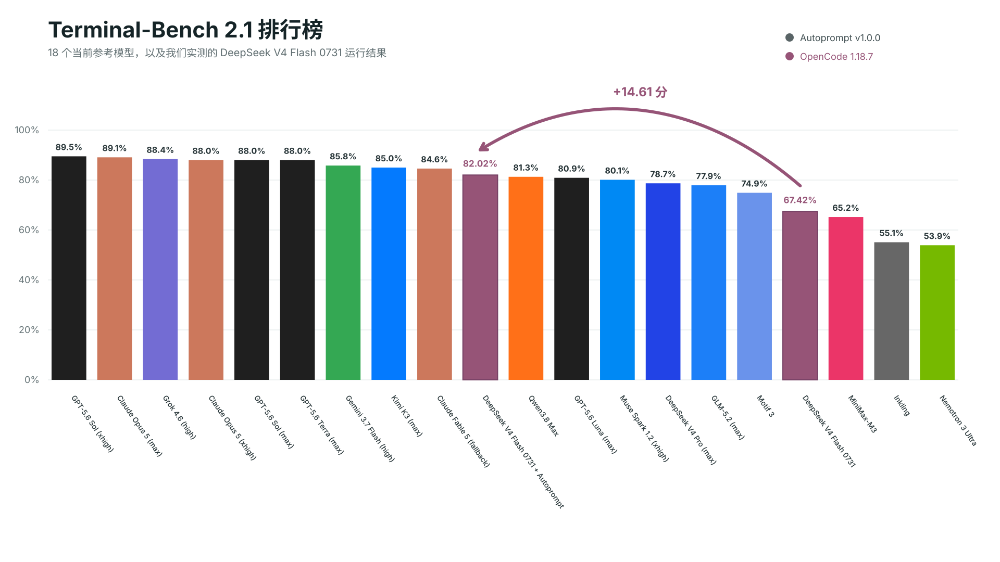
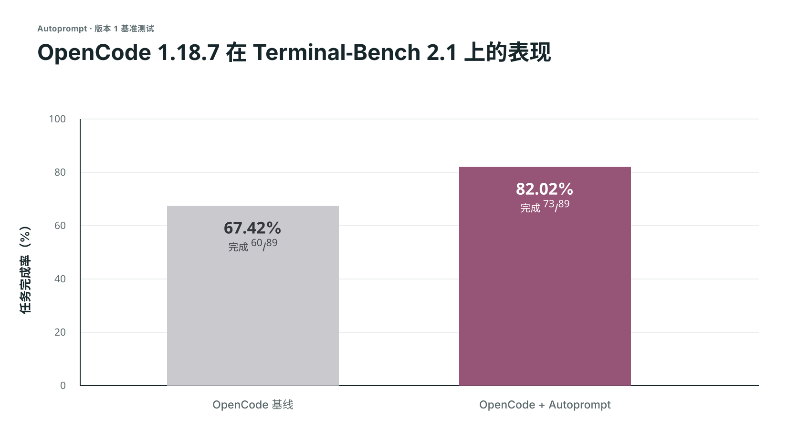
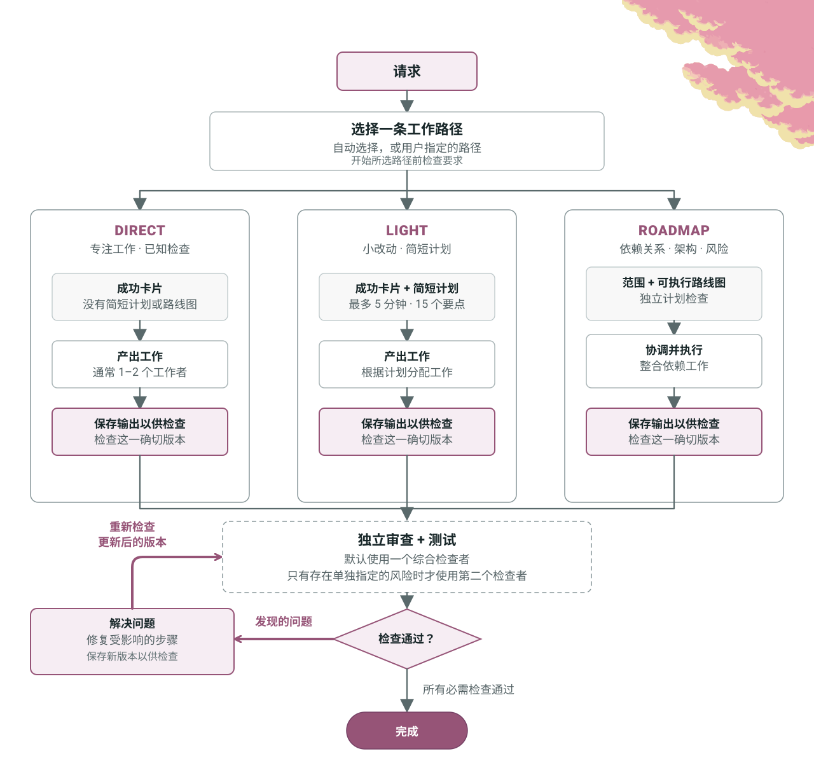
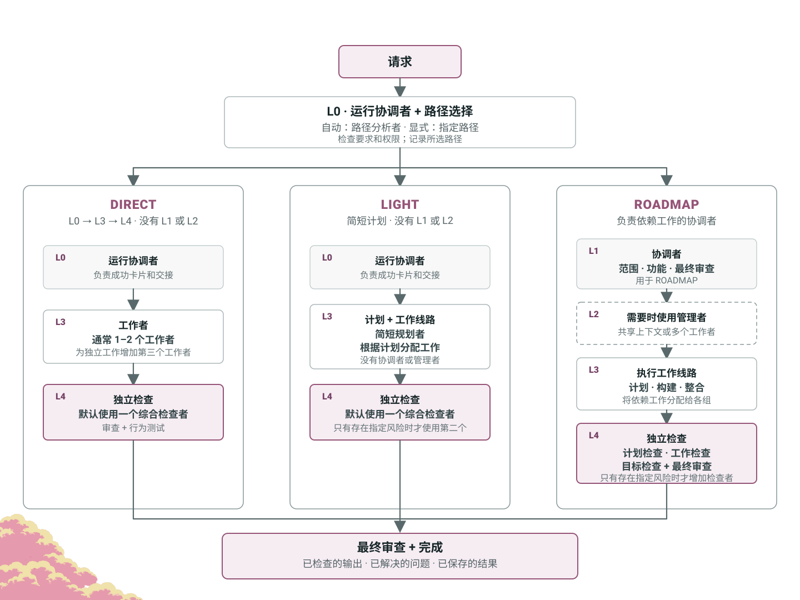

<p align="center">
  
</p>

<p align="center">Autoprompt 是一种编程智能体工作流，通过审查、修复和重新检查工作，将失败率降低 45%。</p>

<p align="center">
  <a href="#基准测试"></a>
  <a href="https://github.com/Spielewoy/autoprompt-skill/releases/latest"></a>
  <a href="#安装"></a>
  <a href="../../LICENSE"></a>
</p>

<p align="center">
  <a href="../../README.md">English</a> |
  <a href="zh.md"><b>中文</b></a> |
  <a href="ko.md">한국어</a> |
  <a href="es.md">Español</a> |
  <a href="ar.md">العربية</a>
</p>

## 目录

[安装](#安装) · [基准测试](#基准测试) · [调用结构](#调用结构) · [运行控制](#运行控制) · [工作方式](#工作方式) · [智能体](#智能体) · [示例](#示例) · [常见问题](#常见问题) · [许可证](#许可证)

## 安装

使用下面的 CLI，或从 [GitHub Releases](https://github.com/Spielewoy/autoprompt-skill/releases/latest) 下载安装程序。

安装此 v2 测试版，请使用下方的**从源码安装**步骤。

### 1. 安装 CLI

```bash
npm install -g autoprompt-skill
```

### 2. 启动安装程序

```bash
autoprompt
```

### 3. 安装

选择你的编程智能体，确认其路径，然后安装。`N` 表示输入其他路径。

要使用其他 CLI 或 IDE，请选择 `Custom coding agent`，并参考[兼容性指南](../guides/custom-agent-compatibility.md)。

<details>
<summary><strong>从源码安装</strong></summary>

```bash
git clone --branch codex/v2-final-merge https://github.com/Spielewoy/autoprompt-skill
cd autoprompt-skill
npm install -g .
autoprompt
```

</details>

### 要求

- [Node.js 20+](https://nodejs.org/en/download)
- [Python 3.11+](https://www.python.org/downloads/)，可通过 `python3` 或 `python` 使用，并安装 [PyYAML](https://pypi.org/project/PyYAML/)
- macOS 或 Linux 上的 [Bash 4.3+](https://www.gnu.org/software/bash/)
- 只有使用 GitHub 检出方式时才需要 [Git](https://git-scm.com/downloads)

### 支持

| 状态 | 编程智能体 | 已测试版本 | 标识 |
|---|---|---|---|
| 正常工作 | [Claude Code](https://code.claude.com/docs/en/setup) | 2.1.263 | `claude` |
| 正常工作 | [Codex](https://github.com/openai/codex) | 0.148.0 | `codex` |
| 正常工作 | [OpenCode](https://opencode.ai/docs/agents) | 1.18.29 | `opencode` |
| 正常工作 | [Kilo Code](https://kilo.ai/docs/customize/custom-subagents) | 7.5.15 | `kilo` |
| 正常工作 | [VS Code](https://code.visualstudio.com/docs/agents/subagents) | 1.136.1 | `vscode` |
| 正常工作 | [Prime Agent](https://github.com/PrimeIntellect-ai/prime-agent) | 0.7.2 | `prime` |
| 正常工作 | [Oh My Pi](https://omp.sh/) | 18.1.14 | `omp` |
| 正常工作 | [DeepSeek Harness](https://deepseek.com/harness/en/) | 0.1.2-rc.1 | `deepseek` |
| 正常工作 | [Reasonix](https://reasonix.io/docs/) | 1.30.0 | `reasonix` |
| 正常工作 | [Hermes Agent](https://github.com/NousResearch/hermes-agent) | 0.21.1 | `hermes` |
| 正常工作 | [Grok Build](https://docs.x.ai/build/overview) | 1.0.13 | `grok` |

这些版本已通过 Linux 运行验证。模型和平台的可用性因提供方而异。

请参阅[支持与审计说明](../faq/which-coding-agents-are-supported.md)。

### 检查、更新或卸载安装

- 检查检测到的每个安装：`autoprompt doctor --strict`
- 检查一个提供方：`autoprompt doctor PROVIDER --strict`
- 更新或修复：运行 `autoprompt`，然后选择一个已安装的提供方
- 交互式卸载：`autoprompt uninstall`
- 卸载一个提供方：`autoprompt uninstall PROVIDER`
- 显示所有命令：`autoprompt help`

将 `PROVIDER` 替换为支持表中的标识，例如 `claude`、`codex` 或 `prime`。

## 基准测试

这些是**版本 1 基准测试**。版本 2 基准测试将随后发布。

<p align="center">
  
</p>

<details>
<summary><strong>OpenCode 实测对比</strong></summary>

<p align="center">
  
</p>

| 轨道 | 完成 | 得分 | 失败 |
|---|---:|---:|---:|
| OpenCode | 60/89 | 67.42% | 29 |
| **OpenCode + Autoprompt** | **73/89** | **82.02%** | **16** |
| **变化** | **+13 项** | **+14.61 分** | **减少 45%** |

</details>

DeepSeek 的 82.7% 使用了它自己的测试设置，因此是参考点，而不是可比较的第三次运行。请阅读[设置与证据边界](../benchmarks/terminal-bench-2.1.md)，或[申请另一项基准测试](https://github.com/Spielewoy/autoprompt-skill/issues/new)。

<details>
<summary><strong>预期取舍：</strong>耗时约为 3 倍，token 约为 2 倍。</summary>

没有保留计时和 token 日志，因此这些是基于用户体验报告的规划估算，而不是实测基准结果。本次实测中失败数从 29 降至 16（减少 45%），也就是错误数约减少 2 倍。注意：对于非常小的任务，结果可能差异很大。

</details>

## 调用结构

```bash
autoprompt activate PROVIDER --target /absolute/project -- "<goal>"
```

| 部分 | 作用 |
|---|---|
| `PROVIDER` | 支持表中的标识，例如 `claude`、`codex` 或 `grok`。 |
| `--target` | 要处理的项目。省略时使用当前目录。 |
| `--` | 将启动器选项与请求分隔开。 |
| `<goal>` | 你想要的结果、约束条件以及检查成功的方法。 |
| `path=` | 可选的 `auto`、`direct`、`light` 或 `roadmap`，放在带引号的目标之前。请参阅[工作路径](../faq/work-paths.md)。 |

```bash
autoprompt activate codex -- path=light "add retries and test the edge cases"
```

## 运行控制

相同的控制项适用于全部 11 个提供方。[自定义模型设置](../faq/how-to-add-custom-models.md)

| 控制项 | 作用 |
|---|---|
| `--concurrency tokensaver` | 一次最多运行六个子智能体。 |
| `--concurrency wide` | 在主机限制内启动已就绪的独立工作。 |
| `--concurrency custom --max-subs N` | 设置自己的并发上限。 |
| `configure PROVIDER --agents off` | 使用提供方配置的模型。 |
| `configure PROVIDER --agents MODEL` | 选择一个模型。在支持时添加 `--effort LEVEL`。 |
| `configure PROVIDER --agents auto --model-map FILE` | 从经过测量的模型注册表中选择。逗号分隔的模型列表也需要 `--model-map`。 |

将并发控制项放在 `--` 之后、带引号的目标之前：

```bash
autoprompt activate codex -- --concurrency custom --max-subs 4 "add retries and tests"
autoprompt configure claude --agents provider/model --effort low
```

## 工作方式

<p align="center">
  <a href="../../assets/i18n/zh/how-it-works-loop.svg"></a>
</p>

## 智能体

<p align="center">
  <a href="../../assets/i18n/zh/how-it-works-hierarchy.svg"></a>
</p>

## 示例

| 目标 | 提示 |
|---|---|
| 修复 | `autoprompt activate claude -- "fix the registration race and add a regression test"` |
| 构建 | `autoprompt activate codex -- --concurrency wide "build the booking flow from API to checkout"` |
| 研究 | `autoprompt activate hermes -- "compare job queues against this codebase and recommend one"` |
| 限制并行工作 | `autoprompt activate grok -- --concurrency custom --max-subs 4 "migrate every model"` |

从项目目录运行这些命令，或在 `--` 之前提供 `--target /absolute/project`。

## 常见问题

<details>
<summary><strong>Autoprompt 是否意味着我完全不必编写提示词？</strong></summary>

不。请提供清晰的目标、约束条件和成功标准。Autoprompt 负责执行循环，因此你不必为每个步骤都编写提示词。[详情](../faq/does-autoprompt-mean-i-do-not-have-to-prompt.md)

</details>

<details>
<summary><strong>Autoprompt 有多大程度的自主性？</strong></summary>

它可以确定范围、实现、测试、审查、修复并验证目标。遇到会改变结果的选择、需要你授权的操作，或无法安全解决的阻塞时，它会停止。[详情](../faq/how-autonomous-is-autoprompt.md)

</details>

<details>
<summary><strong>这些层级有什么用途？</strong></summary>

这些层级将协调、管理、执行和独立判断分开。这种分离使同一个智能体无法同时规划、批准并验证自己的工作。[详情](../faq/what-are-the-layers-for.md)

</details>

<details>
<summary><strong>这些路径是什么？</strong></summary>

`path=auto` 为任务选择路径。`direct` 开始专注的工作，`light` 添加简短计划，`roadmap` 在执行前组织有依赖关系的工作。每条路径都包含独立验证。[详情](../faq/work-paths.md)

</details>

<details>
<summary><strong>并发、模型和路径控制什么？</strong></summary>

`--concurrency` 和 `--max-subs` 设置并行工作上限。`configure --agents` 选择模型，`path=` 选择工作如何规划和协调。[详情](../faq/tokensaver-vs-wide-vs-custom.md)

</details>

<details>
<summary><strong>Autoprompt 为什么不会在后台启动？</strong></summary>

因为它会改变成本、时间和工作流。请使用 `autoprompt activate PROVIDER -- "<goal>"` 显式启动。

</details>

## 许可证

[MIT](../../LICENSE)。版权所有 2026 [Spielewoy](https://github.com/Spielewoy)。

社区：[贡献者](../CONTRIBUTORS.md)、[贡献指南](../CONTRIBUTING.md)、[行为准则](../CODE_OF_CONDUCT.md)、[安全](../SECURITY.md)和[支持](../SUPPORT.md)。
